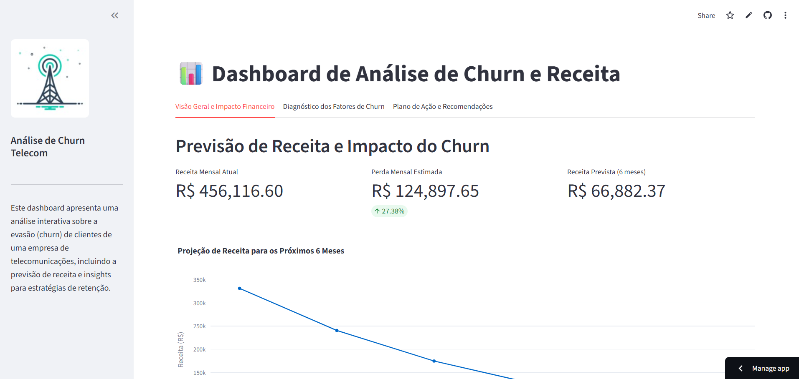

# 📊 Análise de Churn e Previsão de Receita em Telecom

[](https://projeto-churn-telecom.streamlit.app/)

**Acesse o Dashboard Interativo:** **[https://projeto-churn-telecom.streamlit.app/](https://projeto-churn-telecom.streamlit.app/)**

---

## 📖 Visão Geral do Projeto

Este projeto realiza uma análise completa sobre a evasão (churn) de clientes em uma empresa fictícia de telecomunicações. O objetivo principal é identificar os fatores que mais contribuem para o cancelamento de serviços e construir uma solução de Machine Learning que não apenas preveja o churn, mas também demonstre o impacto financeiro e sugira ações estratégicas para a retenção de clientes.

A solução final é um dashboard interativo construído com Streamlit, projetado para ser uma ferramenta de apoio à decisão para as áreas de negócio.

### ✨ Principais Funcionalidades do Dashboard

* **Impacto Financeiro:** Apresenta KPIs como a receita mensal atual, a perda estimada devido ao churn e uma projeção da receita para os próximos 6 meses.
* **Diagnóstico de Churn:** Exibe um gráfico com os principais fatores que influenciam a decisão de um cliente cancelar o serviço, baseado no modelo de Machine Learning. Permite uma análise detalhada e interativa por fator.
* **Plano de Ação Estratégico:** Traduz os insights dos dados em recomendações de negócio concretas e acionáveis para diferentes áreas da empresa (Marketing, Produto, Customer Success).



---

## 📈 Resultados e Insights

* O modelo de **Regressão Logística** foi o que apresentou o melhor desempenho para este problema, atingindo um **recall de 60%**, significando que ele foi capaz de identificar 6 de cada 10 clientes que realmente cancelariam o serviço.
* Os principais fatores que indicam uma alta probabilidade de churn são:
    1.  **Tipo de Contrato:** Clientes com contratos mensais (`Month-to-month`) têm uma propensão muito maior a cancelar.
    2.  **Tempo de Contrato (Tenure):** Clientes mais novos (com poucos meses de serviço) são mais suscetíveis ao churn.
    3.  **Serviços de Proteção:** A ausência de serviços como Suporte Técnico e Segurança Online está fortemente correlacionada com o churn.

---

## 🛠️ Tecnologias Utilizadas

* **Análise de Dados:** `Pandas`, `NumPy`
* **Machine Learning:** `Scikit-learn`
* **Visualização de Dados:** `Plotly`
* **Dashboard Interativo:** `Streamlit`
* **Linguagem:** `Python`
* **Versionamento:** `Git` e `GitHub`

---

## 🚀 Como Executar o Projeto Localmente

Para executar o dashboard no seu próprio computador, siga os passos abaixo:

1.  **Clone o repositório:**
    ```bash
    git clone [https://github.com/luisnogueira11/analise-churn-telecom-streamlit.git](https://github.com/luisnogueira11/analise-churn-telecom-streamlit.git)
    cd analise-churn-telecom-streamlit
    ```
2.  **Crie e ative um ambiente virtual:**
    ```bash
    python -m venv venv
    # No Windows
    .\venv\Scripts\activate
    ```
3.  **Instale as dependências:**
    ```bash
    pip install -r requirements.txt
    ```
4.  **Execute o dashboard:**
    ```bash
    streamlit run dashboard.py
    ```
O dashboard será aberto no seu navegador!

---

## 👨‍💻 Autor

* **Luís Felipe Nogueira Souza**
* **LinkedIn:** [https://www.linkedin.com/in/luísnogueira](https://www.linkedin.com/in/luísnogueira)
* **GitHub:** [https://github.com/luisnogueira11](https://github.com/luisnogueira11)
